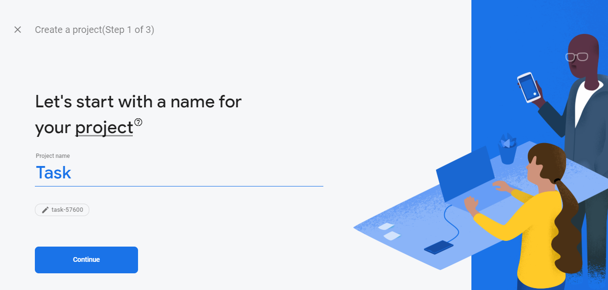
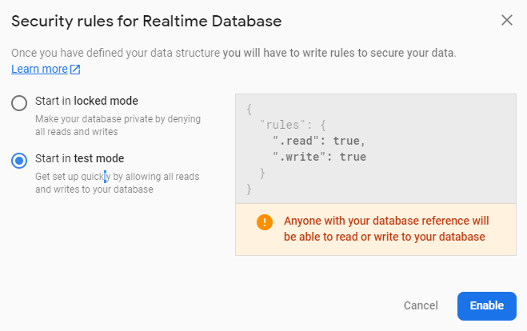
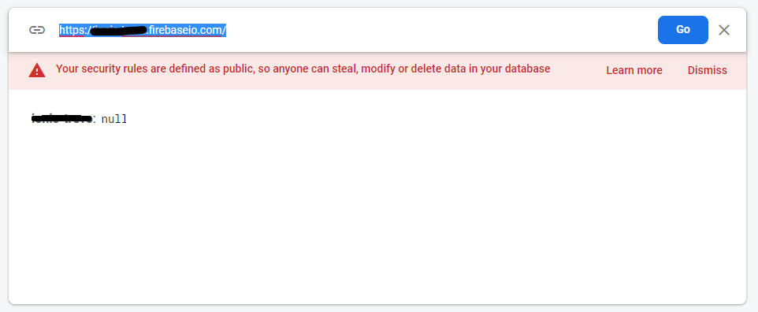
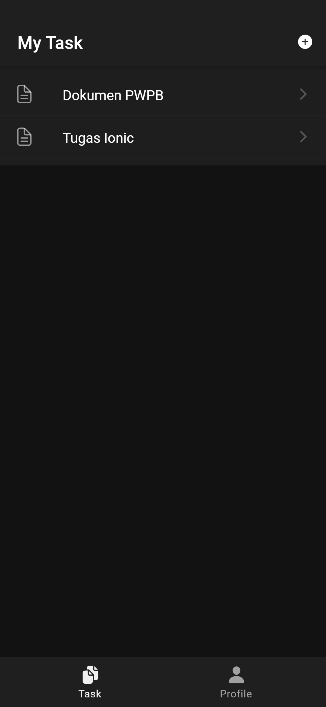
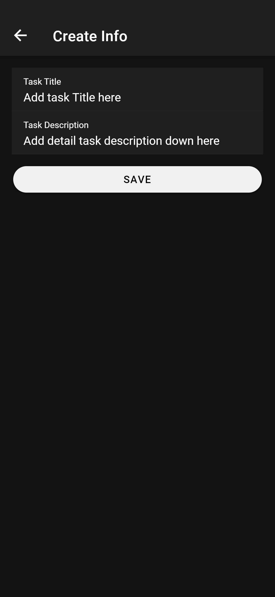
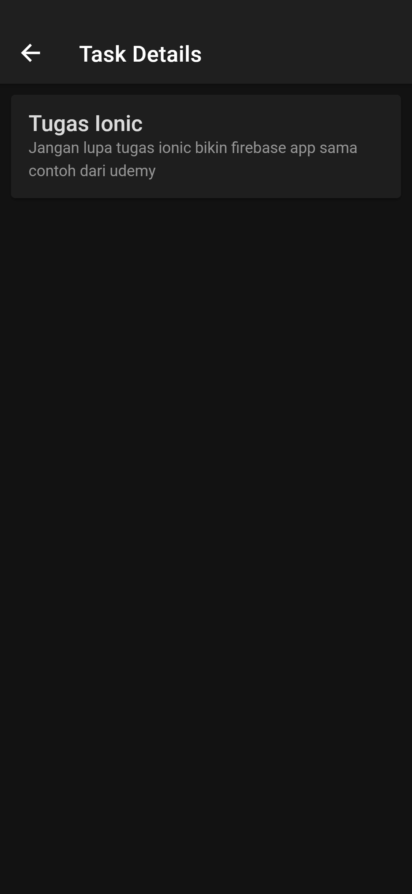
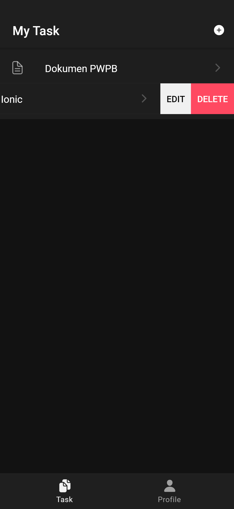
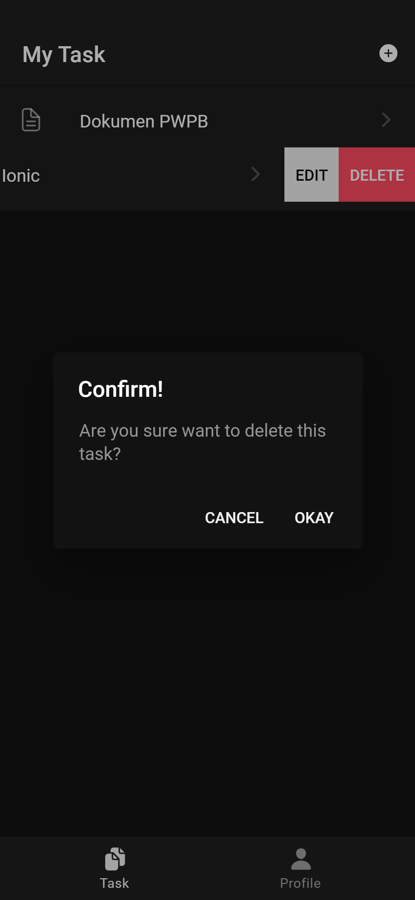

# ion-task
Example of ionic firebase crud project

## Get Started
before using this repository it need some preparation below

### Setup Firebase
* Create new firebase project in [Console Firebase](https://console.firebase.google.com/u/0/)



* Create new firebase realtime database

 

* Setup this config in `src/app/app.component.ts`
```javascript
const config = {
  apiKey: 'YOUR_APIKEY', //can find in project setings
  authDomain: 'YOUR_AUTH_DOMAIN', //same like database without https and /
  databaseURL: 'YOUR_DATABASE_URL', //can find real time database
  projectId: 'YOUR_PROJECT_ID', //can find in project setings
  storageBucket: 'YOUR_STORAGE_BUCKET', //create storage to get this
};
```

### Run Project
* Clone this repo
* Run `npm install`
* Run `ionic serve -l`

### Result
  

  

 
